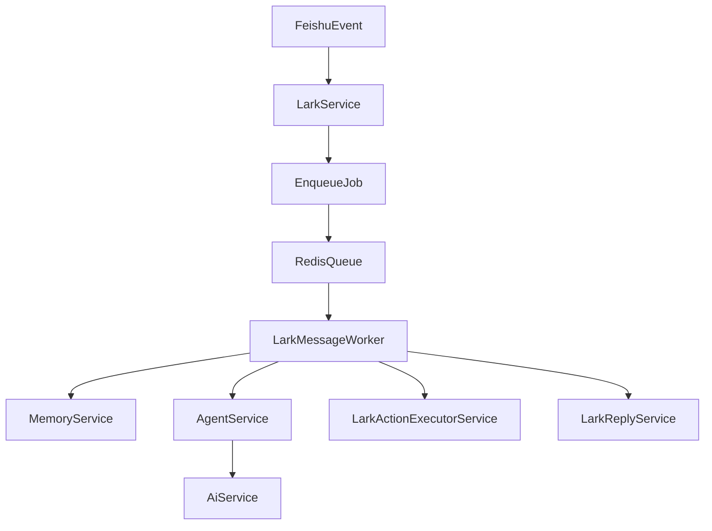

# Redis 队列与 TPM 异步化方案

## 目标

- 在现有 [F:/zeno/src/modules/lark/lark.service.ts](F:/zeno/src/modules/lark/lark.service.ts) 消息入口后增加 Redis 持久化队列，避免 AI 长耗时、TPM 限流、进程重启造成当前消息处理链卡住或丢失。
- 将 [F:/zeno/src/modules/ai/ai.service.ts](F:/zeno/src/modules/ai/ai.service.ts) 里的长时间重试从前台同步链路中移出，交给后台 worker 执行。
- 保持现有 `MemoryService`、`AgentService`、`LarkReplyService` 的主体业务逻辑尽量不重写，只调整调用边界。

## 当前结构结论

- 应用入口是 [F:/zeno/src/main.ts](F:/zeno/src/main.ts) -> [F:/zeno/src/app.module.ts](F:/zeno/src/app.module.ts) -> [F:/zeno/src/modules/lark/lark.module.ts](F:/zeno/src/modules/lark/lark.module.ts)。
- Redis 当前只在 [F:/zeno/src/modules/memory/memory.service.ts](F:/zeno/src/modules/memory/memory.service.ts) 中作为记忆缓存使用，还没有队列框架。
- 飞书事件回调已经是 `void this.processMessage(...)` 的 fire-and-forget，但 [F:/zeno/src/modules/lark/lark.service.ts](F:/zeno/src/modules/lark/lark.service.ts) 内部仍会一路 `await` 到 `AgentService -> AiService.chat`，所以实际处理耗时仍被 TPM 重试拖长。
- TPM/超时/重试集中在 [F:/zeno/src/modules/ai/ai.service.ts](F:/zeno/src/modules/ai/ai.service.ts)：当前单次超时 600000ms，TPM 重试等待 35000ms，且重试发生在调用链内部。

## 方案设计

### 1. 引入统一队列层

- 新增独立 `QueueModule`，默认采用 `BullMQ` 直连现有 `REDIS_URL`，使用单独前缀如 `zeno:queue`，避免和 `zeno:memory:*` 混用。
- 在队列层定义至少一个主队列，例如 `lark-message-processing`，job 负载包含：`messageId`、`senderOpenId`、`text`、`message.content`、必要上下文元数据。
- 由队列 worker 消费 job，并调用现有消息处理逻辑。

### 2. 收敛 `LarkService` 的职责

- 在 [F:/zeno/src/modules/lark/lark.service.ts](F:/zeno/src/modules/lark/lark.service.ts) 保留：飞书 WS 监听、消息去重、文本提取、最轻量的入队前校验。
- 将当前私有 `processMessage()` 拆成两层：
  - `enqueueIncomingMessage()`：事件到达后快速入队。
  - `handleQueuedMessage()`：原 `processMessage` 的主体业务逻辑，改为由 worker 调用。
- 飞书事件到达后立即返回，必要时通过 `LarkReplyService` 先发一条“已接收，正在处理中”的确认消息，减少用户感知等待。

### 3. 把 TPM 重试留在后台 worker，而不是前台处理链

- 保留 [F:/zeno/src/modules/ai/ai.service.ts](F:/zeno/src/modules/ai/ai.service.ts) 作为统一 AI 调用入口，但缩短默认超时和重试参数，避免单个 job 长时间占住 worker。
- 将“是否重试、重试次数、退避时间”拆成可配置项，例如：
  - `AI_TIMEOUT_MS`
  - `AI_MAX_RETRIES`
  - `AI_TPM_RETRY_DELAY_MS`
- 默认改造方向：
  - 前台链路不再等待 TPM 35 秒级 sleep。
  - worker 内允许有限次重试，但上限明显收紧。
  - 超过阈值后快速失败，交给 BullMQ 的 job retry/backoff，而不是在 `AiService.chat()` 里长时间 `await setTimeout()`。

### 4. 统一失败与回执策略

- 队列消费成功后，沿用 [F:/zeno/src/modules/lark/lark-reply.service.ts](F:/zeno/src/modules/lark/lark-reply.service.ts) 发送正式回复并落记忆。
- 队列消费失败时：
  - 记录结构化日志，附带 `messageId` / `userId` / `jobId`。
  - 根据失败类型决定是否由队列重试。
  - 最终失败时发送简洁降级回复，避免消息“吞掉”。
- 去重策略从当前内存 `Map` 扩展为“内存去重 + 队列 jobId 幂等”，降低实例重启或多实例部署时的重复处理风险。

## 主要改动文件

- [F:/zeno/package.json](F:/zeno/package.json)
  - 增加队列依赖，优先 `bullmq`。
- [F:/zeno/src/modules/lark/lark.service.ts](F:/zeno/src/modules/lark/lark.service.ts)
  - 从“直接处理消息”改为“轻量校验后入队”。
- [F:/zeno/src/modules/ai/ai.service.ts](F:/zeno/src/modules/ai/ai.service.ts)
  - 把超时/重试参数配置化，并缩短前台等待；长重试交给队列层控制。
- [F:/zeno/src/modules/lark/lark.module.ts](F:/zeno/src/modules/lark/lark.module.ts)
  - 接入新建的队列模块/worker provider。
- [F:/zeno/src/modules/memory/memory.service.ts](F:/zeno/src/modules/memory/memory.service.ts)
  - 复用 `REDIS_URL` 的连接配置方式，必要时提炼公共 Redis 工厂，避免重复初始化逻辑。
- 新增建议文件：
  - `F:/zeno/src/modules/queue/queue.module.ts`
  - `F:/zeno/src/modules/queue/lark-message.queue.ts`
  - `F:/zeno/src/modules/queue/lark-message.worker.ts`
  - 如需公共配置，可加 `F:/zeno/src/modules/queue/queue.constants.ts`

## 数据流

## 实施顺序

1. 引入 `BullMQ` 和 `QueueModule`，完成 Redis 队列基础设施与健康日志。
2. 将 [F:/zeno/src/modules/lark/lark.service.ts](F:/zeno/src/modules/lark/lark.service.ts) 的 `processMessage` 业务主体迁移到 worker 可调用的方法。
3. 调整 [F:/zeno/src/modules/ai/ai.service.ts](F:/zeno/src/modules/ai/ai.service.ts) 的超时/重试为短等待 + 可配置，并把长退避交由 job retry/backoff 兜底。
4. 补齐成功、失败、重试、最终降级回复路径。
5. 运行 lint 和针对消息处理主链做最小可行验证。

## 验证方式

- 启动服务后，模拟一条飞书消息，确认事件回调能快速结束且消息成功入队。
- 人为制造 `TPM` / `rate_limit` 错误，确认不会在前台链路中等待 35 秒，而是由 worker/job 重试处理。
- 验证最终成功时仍能发送正式回复，最终失败时能发送降级提示。
- 验证 Redis 不可用时日志可定位，且不会 silently fail。

## 风险与注意事项

- 当前 `userContextMap` 和 `processedMessageTimestamps` 都是进程内状态；消息改为队列/worker 后，跨实例一致性会变差，后续可能需要再迁移到 Redis。
- [F:/zeno/src/modules/agent/agent.service.ts](F:/zeno/src/modules/agent/agent.service.ts) 的内存并发计数仍是单实例语义；引入队列后应以 worker 并发为主、该限制为辅。
- 如果你更偏好“仍然在同一轮消息内等最终答案”，也可以不发立即确认消息，但这样只能减少代码阻塞，不能显著改善用户体感。当前默认方案优先解决稳定性与吞吐问题。
