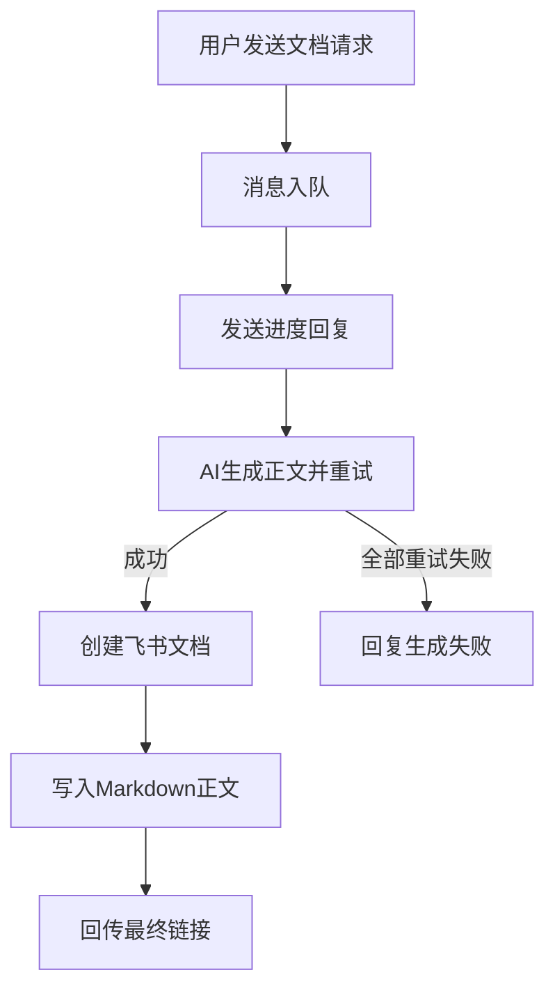

# 重构飞书文档生成链路

## 目标

把当前“先创建文档，再尝试 AI 生成正文并写入”的实现，改成符合你的预期的产品链路：

- 第 1 次回复：只告诉用户“正在生成文档内容，请稍候”。
- 后台链路：AI 生成完整 Markdown 正文，支持重试与超时治理。
- 只有正文生成成功后，才创建飞书文档并写入正文。
- 第 2 次回复：回传“文档已创建 + 链接”。
- 如果重试全部失败：明确回复生成失败，不创建错误内容文档，也不把错误文案写进文档。

## 现状问题

当前实现里，`SCENE_DOC` 的对话回复和最终文档内容来自两条不同链路，导致预期错位：

- [F:/zeno/src/modules/agent/agent-graph.service.ts](F:/zeno/src/modules/agent/agent-graph.service.ts)
  - `doc_node` 现在会先生成一段“会创建文档并回传链接”的用户可见文案。
- [F:/zeno/src/modules/lark/lark-action-executor.service.ts](F:/zeno/src/modules/lark/lark-action-executor.service.ts)
  - `LARK_DOC_CREATE` 现在是“先建文档，再尝试生成正文，再追加正文”。
- [F:/zeno/src/modules/common/instruction-detector.service.ts](F:/zeno/src/modules/common/instruction-detector.service.ts)
  - `processInstruction()` 失败时返回字符串错误文案，而不是可区分的失败结果。
- [F:/zeno/src/modules/lark/lark.service.ts](F:/zeno/src/modules/lark/lark.service.ts)
  - 最终回传依赖 `actionExecutor.execute(...)` 整体结束，缺少“生成中”和“最终成功/失败”的明确分段语义。

## 实施方案

### 1. 调整文档生成时序为“先生成，后创建”

在 [F:/zeno/src/modules/lark/lark-action-executor.service.ts](F:/zeno/src/modules/lark/lark-action-executor.service.ts) 重构 `LARK_DOC_CREATE`：

- 先基于用户请求生成完整 Markdown 正文。
- 生成成功后再调用 `docService.createDocument(...)`。
- 紧接着调用 `appendMarkdownToDocument(...)` 写入正文。
- 最后返回文档链接，供 `LarkReplyService` 做第二次最终回传。

这样可以从根上满足“不要空文档，也不要错误内容文档”。

### 2. 把正文生成改成结构化成功/失败，而不是字符串兜底

在 [F:/zeno/src/modules/common/instruction-detector.service.ts](F:/zeno/src/modules/common/instruction-detector.service.ts) 增加明确的生成结果语义，例如：

- 成功：返回正文 Markdown。
- 失败：抛错或返回结构化失败对象。

不再允许返回类似“抱歉，无法处理该指令”这种给用户看的错误字符串给下游机器链路消费。

同时把面向“文档正文生成”的调用从通用 `processInstruction()` 里抽一层更严格的专用方法，例如文档生成专用接口，避免和普通指令补全文案混用。

### 3. 在 AI 层补充文档生成专用的重试策略

在 [F:/zeno/src/modules/ai/ai.service.ts](F:/zeno/src/modules/ai/ai.service.ts) 增加文档生成专用调用策略，而不是只用当前全局 `AI_MAX_RETRIES`：

- 为正文生成单独设置更合理的超时、重试次数、退避时间。
- 把超时、限流、空内容都视为失败并进入重试。
- 仅在所有重试都失败后，才向上抛出最终失败。

建议把“普通闲聊/短回复”和“长文生成”区分开，因为二者时延预算不同。

### 4. 重写 SCENE_DOC 的对话契约

在 [F:/zeno/src/modules/agent/agent-graph.service.ts](F:/zeno/src/modules/agent/agent-graph.service.ts) 的 `doc_node` 调整为更严格的文案契约：

- 首次对话文案不再说“创建完成后会回传链接”这种宽泛承诺。
- 改为明确的进度提示，例如“我正在为你生成文档正文，完成后会把飞书文档链接回给你”。
- 这条首响只代表进入后台生成，不代表文档已经创建。

这样用户看到的第一条消息和真实后台状态一致。

### 5. 在飞书消息链路中显式支持“两次回消息”

在 [F:/zeno/src/modules/lark/lark.service.ts](F:/zeno/src/modules/lark/lark-reply.service.ts) 梳理两阶段回复：

- 入队后或开始处理时，发送“正在生成”的进度消息。
- 正文成功写入文档后，发送最终结果消息。
- 若所有重试失败，则发送“生成失败，请稍后重试”的最终失败消息。

需要确保首响和终响的职责清晰，不再把最终结果和进度提示混在同一条 `replyText` 里。

### 6. 增加阶段日志与可观测性

在以下文件增加阶段日志：

- [F:/zeno/src/modules/lark/lark-action-executor.service.ts](F:/zeno/src/modules/lark/lark-action-executor.service.ts)
- [F:/zeno/src/modules/common/instruction-detector.service.ts](F:/zeno/src/modules/common/instruction-detector.service.ts)
- [F:/zeno/src/modules/ai/ai.service.ts](F:/zeno/src/modules/ai/ai.service.ts)
- [F:/zeno/src/modules/lark/lark.service.ts](F:/zeno/src/modules/lark/lark.service.ts)

建议至少覆盖：

- `doc_generation_started`
- `doc_generation_retrying`
- `doc_generation_succeeded`
- `doc_generation_failed`
- `doc_create_started`
- `doc_create_succeeded`
- `doc_write_started`
- `doc_write_succeeded`
- `final_reply_sent`

## 关键链路图

## 重点测试

补充或更新以下测试：

- [F:/zeno/src/modules/lark/lark-action-executor.service.spec.ts](F:/zeno/src/modules/lark/lark-action-executor.service.spec.ts)
  - 正文生成成功时：先生成，再建文档，再写入。
  - 正文生成超时但重试成功时：最终能写入正确正文。
  - 正文生成全部失败时：不得创建文档、不得写入错误文案。
- [F:/zeno/src/modules/lark/lark.service.spec.ts](F:/zeno/src/modules/lark/lark.service.spec.ts)
  - 验证“两次回消息”的时序。
  - 验证最终失败时只回失败提示，不产生错误内容链接。

## 主要改动文件

- [F:/zeno/src/modules/lark/lark-action-executor.service.ts](F:/zeno/src/modules/lark/lark-action-executor.service.ts)
- [F:/zeno/src/modules/common/instruction-detector.service.ts](F:/zeno/src/modules/common/instruction-detector.service.ts)
- [F:/zeno/src/modules/ai/ai.service.ts](F:/zeno/src/modules/ai/ai.service.ts)
- [F:/zeno/src/modules/agent/agent-graph.service.ts](F:/zeno/src/modules/agent/agent-graph.service.ts)
- [F:/zeno/src/modules/lark/lark.service.ts](F:/zeno/src/modules/lark/lark.service.ts)
- [F:/zeno/src/modules/lark/lark-reply.service.ts](F:/zeno/src/modules/lark/lark-reply.service.ts)
- [F:/zeno/src/modules/lark/lark-action-executor.service.spec.ts](F:/zeno/src/modules/lark/lark-action-executor.service.spec.ts)
- [F:/zeno/src/modules/lark/lark.service.spec.ts](F:/zeno/src/modules/lark/lark.service.spec.ts)

## 风险与兼容性

- 这次改动会影响所有 `SCENE_DOC -> LARK_DOC_CREATE` 路径，不只是 bullmq 这个案例。
- 如果 `InstructionDetectorService` 的失败语义收紧，可能会影响其它依赖 `processInstruction()` 的补全文案场景，需要局部兼容或拆专用接口。
- 若未来还要支持“先建空文档再持续流式填充”，应作为另一条显式产品模式，而不是混在当前严格模式里。
